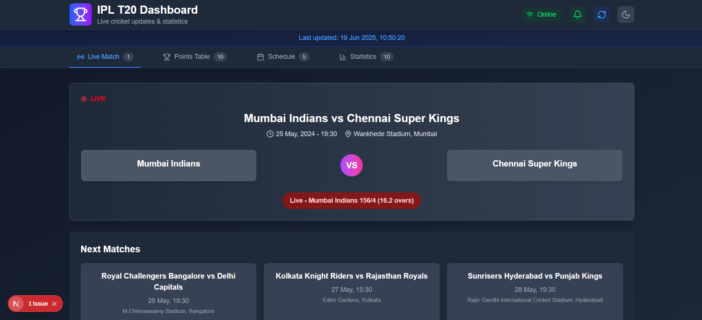
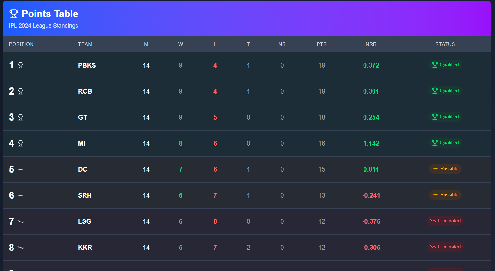
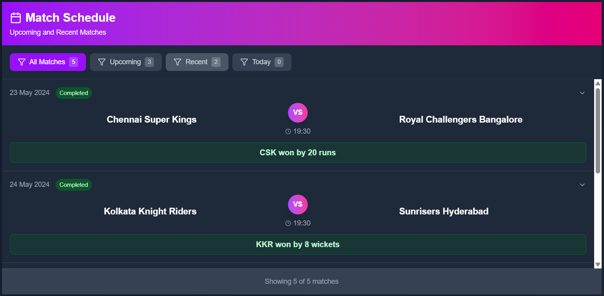
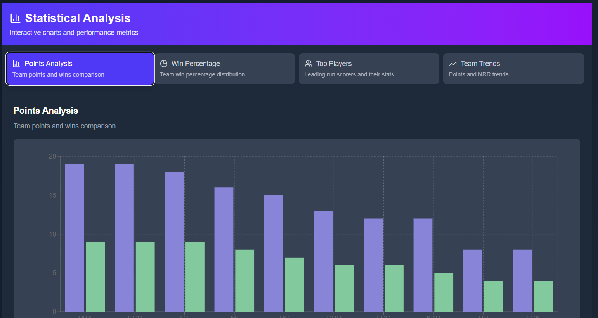
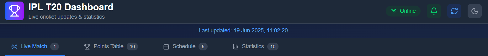
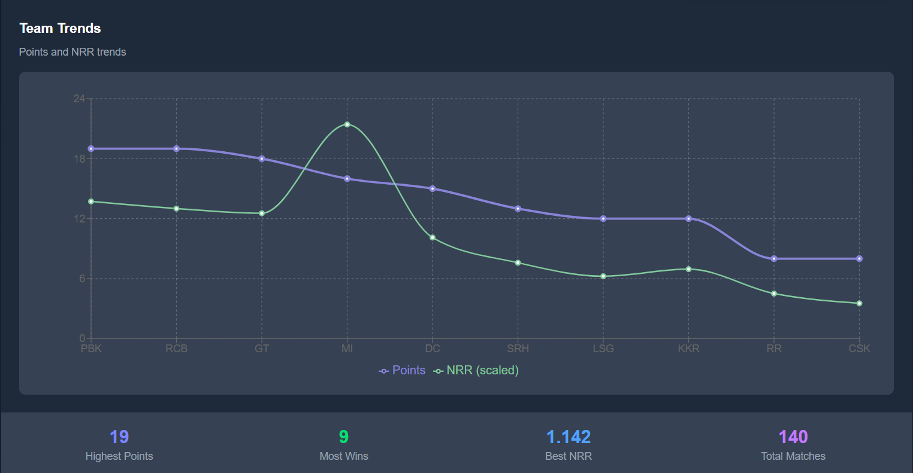

# IPL T20 Live Dashboard 🏏

### Project setup

`npm install`
`npm run dev`

### Disclaimer

- Next JS
- TypeScript
- Tailwind CSS
- Node.js (BE)

## Features

1. Live and Upcoming match display (Dashboard)
   

2. Points Table
   

3. Match Schedule with multiple filters
   

4. Statistics (Bar Graphs, Pie Chart, Line Chart)
   
5. Caching
   
6. Historic Data
   

### Disclaimer!!!

Since the IPL season is over, there were no live matches, match schedules, statistic data. Hence tht data is mocked. However, points table is scraped from iplt20.com.
